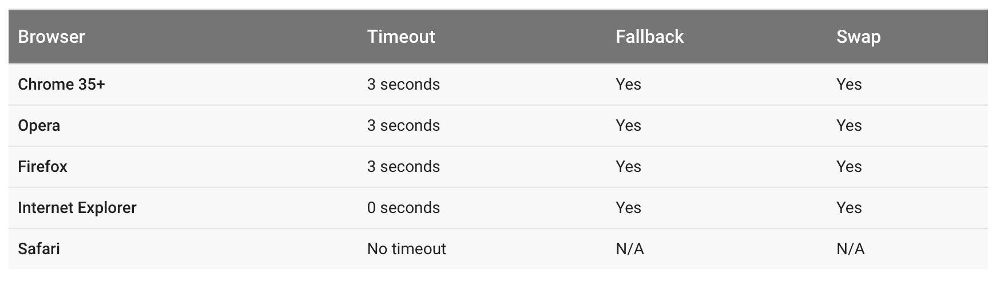

autoscale: true,
build-lists: true

### Best practice for loading fonts

- Web fonts can have sever performance and design issues

- FOIT, or Flash of Invisible Text

- FOUT, or Flash of Unstyled Text

---

### Render blocking

- Because fonts are referenced in the `<head>` of the HTML document they must be downloaded before they can be displayed

---

## Current browsers

To offset this browsers implement a timeout after which a fallback font will be used

^
Chrome and Firefox have a three second timeout after which the text is shown with the fallback font. If the font manages to download, then eventually a swap occurs and the text is re-rendered with the intended font.
^
Internet Explorer has a zero second timeout which results in immediate text rendering. If the requested font is not yet available, a fallback is used, and text is re-rendered later once the requested font becomes available.
^
Safari has no timeout behavior (or at least nothing beyond a baseline network timeout).
^
To make matters worse, developers have limited control in deciding how these rules will affect their application.
^
In some versions of iOS Safari, users could see a blank page up to thirty seconds, depending on the speed of their internet connection and the size of the site's custom fonts.

---

### Web Font Loader

- The old(ish) way

- JavaScript library co-developed by Google and Typekit, but it can load fonts from other services as well as local fonts.

- Acts asynchronously (scheduled to load only what is needed at the moment)

- Must be loaded in the head which can add extra overhead

---

### Font face observer

- Esentially polyfills the native `font-loading` api

